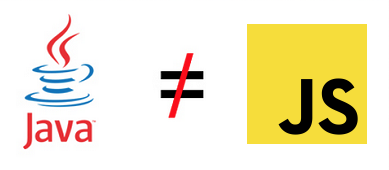
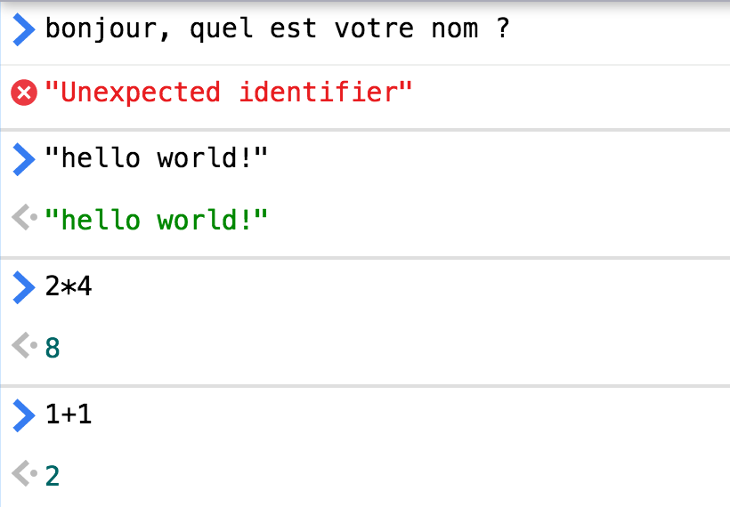

# Les bases

## Introduction à la Programmation et à JavaScript

### Langage de programmation

JavaScript est un langage qui permet de donner des ordres (appelés *instructions*) à une machine.

La machine en question peut être:

- un navigateur web
- un ordinateur
- un serveur sur internet
- un objet intelligent (ex: Arduino, Raspberry Pi...)
- voire même une carte à puce ! (ex: carte SIM, carte bleue...)

On va donc apprendre des commandes et structures pour expliquer ce qu'on attend de cette machine.

### Qu'est-ce qu'un programme ?

Le code source d'un programme est un peu comme une recette de cuisine: on y définit une liste d'actions (les *instructions*) qui permettent à quiconque de reproduire le plat, autant de fois qu'il le veut.


Comme dans une recette, si votre code source est trop vague ou contient des erreurs, le résultat risque d'être décevant, voire complètement à côté de la plaque.

Contrairement à une recette de cuisine, il faut garder en tête que ce n'est pas un humain qui va interpréter votre code source, mais une machine. Sachant que, contrairement à un humain, une machine n'est pas capable de raisonner intuitivement, il faut être extrêmement rigoureux dans le respect des règles de grammaire et d'orthographe du langage.


Si vous écrivez votre code de manière approximative, deux choses peuvent se passer:

- si vous avez de la chance, la machine vous avertira qu'elle n'a pas compris une de vos instructions => elle affichera un message d'erreur pour vous aider à la corriger;
- soit, dans certains cas, il ne se passera rien de visible. Dans ce cas, ce sera à vous de relire votre code, et de vous mettre à la place de la machine pour essayer de comprendre comment elle l'interprète.

## Histoire du langage JavaScript

JavaScript a été créé en 1995, pour le compte de la société Netscape (éditeur d'un des premiers navigateurs web, dont Mozilla Firefox est l'héritier), puis standardisé sous le nom d'ECMAScript (souvent réduit à ses initiales "ES").


Utilisable sur de nombreuses plate-formes, JavaScript est le seul langage de programmation inclus en standard dans les navigateurs web. On dit donc que c'est "le langage du web".



> Même si le nom ressemble, Java est un langage différent de JavaScript. Si vous avez la flemme de prononcer "JavaScript", utilisez donc ses initiales "JS" plutôt que "Java".

Malgré ses nombreuses évolutions, JavaScript est plutôt un langage de script qu'un langage de programmation, à proprement parler. En effet, il a été conçu comme une solution simple pour ajouter des interactions aux pages HTML du web, et non pour créer des logiciels à haut niveau de sûreté. Une des conséquences: c'est un langage faiblement typé. Nous allons voir ça plus bas.


### Exécution de code JavaScript

Il y a deux façons d'exécuter nos instructions JavaScript:

1. de manière interactive: via une console
2. de manière programmative: en rédigeant un code source

Dans le premier cas, chaque instruction sera exécutée immédiatement puis retournera un résultat, comme sur une calculatrice.


Dans le deuxième cas, on va écrire une liste d'instructions dans un fichier (appelé "code source"), pour que notre machine puisse exécuter ce fichier en une seule fois.

Pour tester JavaScript en mode interactif depuis Google Chrome, visitez n'importe quelle page web, ouvrez la console JavaScript (raccourci clavier: `Cmd`+`Alt`+`J` ou `Ctrl`+`Shift`+`J`), tapez `1+1` et validez. La console devrait afficher le résultat de cette opération. Ensuite tapez `alert('bonjour');` et observez ce qui se passe.



> Il existe de nombreux consoles JavaScript plus ou moins évoluées:
> - [jsconsole.com](https://jsconsole.com/) est ma préférée, car la plus simple;
> - [repl.it](https://repl.it/languages/javascript) et [glot.io](https://glot.io/new/javascript) permettent d'éditer son code de manière un peu plus confortable mais ne conserve pas d'historique de vos instructions;
> - [runkit](https://runkit.com/), cumule les avantages des autres, mais il est plus complexe à utiliser.

## Manipulation de valeurs

En langue Française, il existe plusieurs types de mots: les noms, les verbes, les adjectifs, les prénoms, etc...

De la même façon, en maths, on peut manipuler plusieurs types de valeurs: nombres entiers, décimaux, rationnels (fractions), complexes, etc...

En JavaScript, c'est pareil. Il est possible d'exprimer et de manipuler des valeurs de différents types.


### Types simples

+ booléen (*boolean*): `true`, `false`
+ nombre (*integer/float number*): `999`, `0.12`, `-9.99`
+ chaîne de caractères (*string*): `"bonjour"`, `'coucou'`
+ aucune valeur: `null`

### Types avancés

+ non défini: `undefined`
+ objet (*object*): `{ prop: 'valeur' }`
+ tableau (*array*): `[ 1, 2, 3 ]`
+ fonction (*function*): `function(){ /* ... */ }`

### Quel type ?

```js
"bonjour" + 4
{ a: 0.4 }
0
true
2 - 1.2
[ 'a', 'b', 'c' ]
```

> Le mot clé `typeof` renvoie le type de l'expression qui suit.

Attention au dernier !

### Variables et opérateur d'affectation

- Toute valeur peut être stockée dans une variable (`var`)
- Les variables sont nommées de manière alphanumérique, sans guillemets
- `=` permet d'affecter une valeur (à droite) à une variable (à gauche)

```js
var maVariable = 'mon texte';
console.log(maVariable); // => affiche: mon texte

maVariable = `mon nouveau texte`;
console.log(maVariable); // => affiche: mon nouveau texte
```

---

### Comparaisons de valeurs

- `==` permet de comparer deux valeurs de manière laxiste
- `===` permet de comparer deux valeurs de manière stricte

```js
1 == '1' // => true
1 === `1` // => false (car types différents)

0 == false // => true
0 === false // => false

null == undefined // => true
null === undefined // => false
```

--

- L'inégalité se vérifie avec `!=` et `!==`, respectivement.
- `<`, `>`, `<=`, `>=` sont aussi des opérateurs de comparaison.
- Ces opérateurs sont utilisés dans les conditions `if`.

---

### Accéder aux propriétés d'un objet

- Un objet associe des valeurs à des propriétés.
- Les valeurs de ces propriétés peuvent être de n'importe quel type.

```js
var obj = {
  maProp1: 'valeur 1', // propriété maProp1 de type string
  maProp2: {           // propriété maProp2 de type object
    maProp3: 4         // propriété maProp3 de type number
  }
};
```

--

- Deux moyens d'accéder aux valeurs d'un objet (et d'un tableau):

```js
// notation pointée
obj.maProp1 // => 'valeur 1'
obj.maProp2.maProp3 // => 4

// notation avec crochets (permet l'utilisation de variables)
obj['maProp1'] // => 'valeur 1'
obj['maProp2']['maProp3'] // => 4
```

---

### Accéder aux valeurs d'un tableau (même principe)

- Un tableau est un objet dont les propriétés sont des nombres entiers appelés **indices** (*index*).
- Tout tableau a une propriété `.length` qui vaut le nombre de ses valeurs.

```js
var tab = [
  'valeur 1', // 1ère valeur (indice=0) de type string
  {           // 2ème valeur (indice=1) de type object
    maProp3: 4
  }
];
```

--

- Accéder aux valeurs d'un tableau:

```js
// notation avec crochets (permet l'utilisation de variables)
tab[0] // => 'valeur 1'
tab[1] // => { maProp3: 4 }
```

- La notation avec crochets `tab[i]` est souvent utilisée dans boucles `for`.

---

### Énumérer les valeurs d'un objet/tableau

- Dans les deux cas, on peut utiliser une boucle `for` pour lister les valeurs.
- Pour un tableau:

```js
for (var i=0; i<tab.length; ++i) {
  console.log(i, tab[i]);
}
```

- Pour un objet:

```js
for (var p in obj) {
  console.log(p, obj[p]);
}
```

---

### Mise en pratique: fonction affiche()

Objectif: définir une fonction `affiche()` qui affiche dans la console le contenu de la valeur passée en paramètre, en fonction de son type.

- Si le paramètre n'est pas défini, afficher `(aucune valeur)`
- Si le paramètre est de type `null`, afficher `(valeur nulle)`
- Si le paramètre est de type `string`, afficher `chaîne: <valeur> (<longueur>)`
- Sinon, afficher `type non supporté pour l'instant`

Tests:

```js
affiche() // => (aucune valeur)
affiche(undefined) // => (aucune valeur)
affiche(null) // => (valeur nulle)
affiche('hey') // => chaîne: hey (3)
affiche(3) // => type non supporté pour l'instant
affiche([1,2,3]) // => type non supporté pour l'instant
affiche({a:1}) // => type non supporté pour l'instant
affiche(function(){}) // => type non supporté pour l'instant
```

---

### Exercice: Compléter la fonction affiche()

Objectif: ajouter le support des objets et tableaux dans notre fonction affiche().

- Si le paramètre est de type `function`, afficher `fonction`
- Si le paramètre est un nombre ou un booléen, afficher `<type>: <valeur>`
- Si le paramètre est de type `object`, afficher `objet:` suivi d'une ligne par propriété:<br/>
    `- <propriété>: <valeur>`

- Si le paramètre est un tableau, afficher `tableau de <longueur> éléments:` suivi d'une ligne par valeur:<br/>
    `- <valeur>`

Tester que la fonction fonctionne bien avec chaque type de valeur.

BONUS: Rendre la fonction récursive, afin d'afficher de manière indentée les objets et tableaux contenus dans d'autres.


