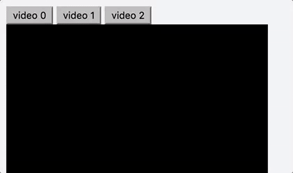
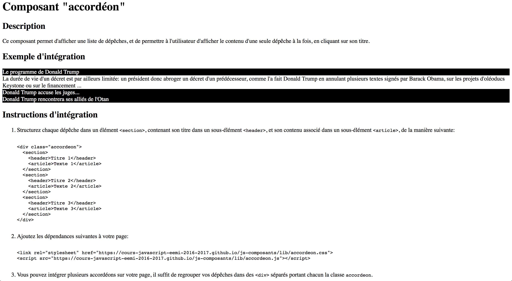
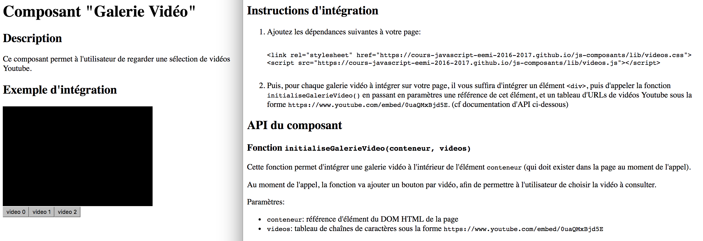

# Chapitre 6: Composants et POO

Objectifs:

- Développer un composant web simple
- Permettre à un même composant d'être instancié plusieurs fois sur une même page
- Initiation à la Programmation Orientée Objet et au mot clé `this`

Plan du chapitre:

1. Création d'un composant Web simple (<a href="./slides/10-composants/index.html" target="_blank">Slides du TP</a>)
  - Exercice: Accordéon / Carousel / Galerie vidéo
2. Composant Web multi-instances et POO (<a href="./slides/11-poo/index.html" target="_blank">Slides du TP</a>)
  - Défi: Plusieurs instances de Carousel sur une même page
  - Deux manière de rendre générique un composant
  - Programmation Orientée Objet: classes, instances et `this`

---

## 1. Création d'un composant Web simple

Sur le Web, un composant est un programme qui permet de fournir une interface intégrable, conçue pour un usage précis, mais personnalisable par chaque développeur.

> Par exemple, si je développe et diffuse un composant de galerie d'images, d'autre développeurs pourront intégrer simplement mon composant sur leur site, et y ajouter les images de leur choix.

Les composants permettent donc d'enrichir le contenu, l’esthétique, et/ou les interactions proposées par un site Web, en ré-utilisant du code qui n'a pas été écrit spécifiquement pour ce site.

Il existe de très nombreux composants publiés sur Internet et utilisables gratuitement. Pour la plupart, ils sont basés sur la librairie "jQuery" (dont nous parlerons plus tard dans ce cours). Mais nombreux ont été conçus en JavaScript/DOM natif (aussi appelé "Vanilla JavaScript"), et peuvent donc fonctionner sans jQuery.

**Note: Dans le cadre de ce cours, l'usage (direct ou pas) de jQuery ne sera pas accepté.**

Voici quelques exemples de composants natifs intégrables librement:

- [Sweet Alert](http://t4t5.github.io/sweetalert/)
- [Dialog Modal](https://frend.co/components/dialogmodal/)
- [Animate on scroll](https://github.com/michalsnik/aos)
- [Tranglify](http://qrohlf.com/trianglify/)

Vous pourrez trouver d'autres composants natifs sur le site [Vanilla List](http://www.vanillalist.com/).

À ce stade, nous allons apprendre à réaliser un composant *simple*, dans le sens où celui-ci ne sera pas suffisamment modulaire pour être intégré plusieurs fois sur une même page. Nous verrons plus tard comment faire cela.

### Généricité et instructions d'intégration

Afin que notre composant puisse être intégré de manière personnalisée par chaque développeur, quelque soit le site Web en question et son contenu, il est important de définir quelques règles et abstractions.

D'abord, un composant doit être simple à intégrer, et un utilisateur de composant ne devrait jamais avoir à consulter ni modifier le code source du composant. Il va falloir donc que le composant soit suffisamment générique et configurable depuis le site Web qui l’intégrera.

Par exemple, un composant de galerie d'images doit s'adapter à une liste d'images fournie par un développeur désirant l'intégrer, et l'intégrateur ne devrait en aucun cas avoir à modifier la liste d'images dans le code source du composant.

Pour cela, un composant:

- ne doit pas contenir de valeurs et références littérales; (ex: nombre d'images et/ou URLs des images stockés "en dur" dans le code du composant)
- doit définir et documenter les règles et contraintes éventuelles que devront respecter les intégrateurs du composant.

Exemples d'instructions d'intégration fournies par la documentation d'un composant:

- *toutes les images à afficher dans la galerie doivent être des balises `` portant la classe `carousel-img`*;
- ou encore: *appeler la fonction creerGallerie() (définie par le composant) en passant en paramètres l'identifiant du DIV devant contenir la galerie, et un tableau d'URLS d'images*.

Prenez le temps d'analyser les instructions d'intégration des composants listés plus haut.

### Exercice 1: développer et documenter un composant simple

Pour mettre en pratique cette partie du chapitre, développer un des trois composants suivants, et fournir la page de documentation associée.

La page de documentation doit contenir:

- une description concise du composant: à quoi il sert, quelles sont ses fonctionnalités et avantages éventuels;
- une démonstration du composant, pour le tester depuis la page;
- les instructions permettant d'intégrer simplement ce composant à son site;
- la description des fonctions et/ou paramètres éventuellement fournis par le composant;
- BONUS: la liste des navigateurs (et leur versions) sur lesquels le composant fonctionne;
- BONUS: le composant et sa documentation publiés sur GitHub.

S'inspirer de la documentation des composants fournis plus haut en exemple.

> Conseil pratique: pour afficher du code source sur une page HTML sans que celui-ci ne soit interprété par le navigateur, utiliser la balise `<xmp>`.

#### Composant: Carousel

Un "carousel" est un composant de galerie d'images permettant à l'utilisateur de passer d'une image à l'autre, et éventuellement d'agrandir une image en plein-écran.


Certains carousels passent automatiquement d'une image à l'autre, à l'aide d'un minuteur (`setTimeout()` ou `setInterval()`).

Pour développer un carousel, il faut maîtriser:

- les sélecteurs DOM (`getElementById()`, `getElementsByClassName()` et/ou `getElementsByTagName()`),
- la manipulation de styles et/ou classes CSS en JavaScript,
- la capture d'événements `onclick`,
- et l'opérateur modulo (`%`).

> Solution: [Jsfiddle](https://jsfiddle.net/adrienjoly/vvtyx0hp/)

#### Composant: Accordéon

Un "accordéon" est un composant proposant plusieurs rubriques à l'utilisateur, et lui permettant d'afficher le contenu d'une rubrique à la fois, en cliquant sur son titre.


Pour développer un accordéon, il faut maîtriser:

- les sélecteurs DOM (`getElementById()`, `getElementsByClassName()` et/ou `getElementsByTagName()`),
- la manipulation de styles et/ou classes CSS en JavaScript,
- la capture d'événements `onclick`,
- et la gestion du scope.

> Solution: [Jsfiddle](https://jsfiddle.net/adrienjoly/wL3pex4e/)

#### Composant: Galerie vidéo

Une galerie vidéo permet à l'utilisateur de visualiser une vidéo, en cliquant parmi une sélection fournie.



Pour développer une galerie vidéo, il faut maîtriser:

- les sélecteurs DOM (`getElementById()`, `getElementsByClassName()` et/ou `getElementsByTagName()`),
- la capture d'événements `onclick`,
- l'intégration d'`<iframe>` (ex: à l'aide de `innerHTML`),
- et la gestion du scope.

> Solution: [Jsfiddle](https://jsfiddle.net/adrienjoly/Lz8tcq0y/)

---

## 2. Composant Web multi-instances et POO

### Défi: Plusieurs instances de Carousel sur une même page

Dans la partie précédente, vous avez appris à développer un composant Web simple.

Mais votre composant fonctionnera-t-il correctement si vous l'intégrez plusieurs fois sur une même page Web ? (Essayez, et observez ce qui se passe !)

Supposons par exemple que vous ayez développé un composant de Carousel permettant de créer une galerie d'images à partir des éléments `` de la page portant la classe `carousel-img` (comme [celui-ci](https://jsfiddle.net/adrienjoly/vvtyx0hp/)). Si vous souhaitez intégrer deux galeries indépendantes sur votre page, avec des images spécifiques à chacune d'elles, le composant ne sera pas capable de faire la distinction entre les images de ces deux galeries, car il se contente de créer une galerie à partir de *toutes* les images portant la classe `carousel-img` !

Alors, comment faire pour qu'un composant puisse être intégré plusieurs fois sur une même page ?

Il existe plusieurs solutions, notamment:

- implémenter le composant de manière à ce qu'il s'applique sur des groupes d'éléments, plutôt que sur les éléments eux-mêmes; (ex: chercher les éléments portant une classe `image-group`, puis intégrer les images définis comme sous-éléments de ce groupe)
- ou permettre à l'intégrateur de préciser spécifiquement sur quelles images chaque galerie doit être construite, et à quel moment elles doivent être construites. (ex: en appelant une fonction fournie par le composant, en passant en paramètres l'`id` de l'élément contenant les images de la galerie à intégrer)

Nous allons voir ces deux solutions plus en détails.

### Solution 1: Composant qui s'applique sur des groupes d'éléments

Supposons que notre composant à intégrer fournisse les instructions d'intégration suivantes:

*Au chargement du composant, chaque élément portant la classe `image-group` sera transformé en Carousel, à partir des balises `` définis dans cet élément.*

On pourrait alors intégrer le composant de la manière suivante:

```html
Galerie 1:
<div class="image-group">
  
  
  
</div>
Galerie 2:
<div class="image-group">
  
  
  
</div>
<script src="carousel.js"></script> <!-- va convertir les groupes en galeries -->
```

Pour fonctionner ainsi, le code source du Carousel devra récupérer les images de chaque groupe, de la manière suivante:

```js
var groupes = document.getElementsByClassName('image-group');
for (var i = 0; i < groupes.length; i++) {
  var groupe = groupes[i];
  var imagesDuGroupe = groupes[i].getElementsByTagName('img');
  creerGalerie(groupe, imagesDuGroupe); // création de la galerie dans l'élément groupe
}
```

... au lieu de se contenter d'un unique appel à `document.getElementsByTagName('img')`, applicable à l'ensemble des images de la page.

> Remarque: Ici, nous avons appelé la fonction `getElementsByTagName()` sur un élément, et non sur `document`. Ceci a pour effet de ne retourner que les éléments qui sont contenus à l'intérieur de cet élément parent.

Avantages de cette solution:

- simple à implémenter, à documenter et à intégrer.

Inconvénients de cette solution:

- l'intégrateur ne peux pas générer une galerie à la demande, car les galeries sont toutes générées au moment où le composant est chargé.

#### Exemple de documentation d'un composant pour groupes d'éléments



### Solution 2: Composant contrôlable par l'intégrateur

La solution précédente est simple mais empêche à l'intégrateur de contrôler la transformation de chaque galerie.

Par exemple, comment regénérer une galerie après l'ajout d'une image ?

Pour permettre ce genre de manipulation, il faudrait que chaque galerie soit accessible individuellement depuis le code JavaScript de l'intégrateur.

Idéalement, l'intégrateur aimerait pouvoir effectuer ce genre d'appel:

```js
maGalerie2.ajouterImage('img7.jpg');
maGalerie2.regenerer();
```

Pour cela, il faudrait que chaque galerie puisse être référencée par une variable, et donc que le composant fournisse un moyen de retourner une variable pour chaque galerie créée.

La solution consiste à ce que le code source du composant définisse une fonction pour créer une galerie et retourner une référence vers un objet permettant à l'intégrateur d'interagir avec cette galerie.

Exemple:

```js
// extrait de code source du composant
function creerGalerie(conteneur, urlImages) {
  var html = '';
  // génération des éléments  dans le conteneur
  for (var i = 0; i < urlImages.length; i++) {
    html = html + ';
  }
  conteneur.innerHTML == html;
  // TODO: afficher la première image seulement
  // TODO: créer un objet reference permettant à l'intégrateur de manipuler la galerie
  return reference;
}
```

La documentation du composant contiendrait alors les instructions d'intégration suivantes:

*Pour chaque galerie à créer, appeler la fonction `creerGalerie(conteneur, urlImages)`, avec `conteneur` étant une référence de l'élément dans lequel créer la galerie (ex: un `<div>`), et `urlImages` un tableau contenant les URLs des images à intégrer dans la galerie. Cette fonction retourne un objet vous permettant d'interagir avec la galerie.*

#### Exemple de documentation d'un composant proposant une API



Comment définir cet objet `reference` qui permettra à l'intégrateur d'interagir distinctement avec chaque galerie ? En définissant puis instanciant une classe, tel que nous allons le voir ensuite.

### Programmation Orientée Objet: classes, instances et `this`

Une classe est un modèle d'objet. Elle peut être instanciée, c'est à dire qu'on crée un objet (appelé *instance*) selon ce modèle.

La modèle d'une classe consiste à assurer que chaque objet instance de cette classe aura les mêmes:

- propriétés; (*cf chapitre sur les types avancés*)
- et méthodes: des fonctions qui s'appliquent à une instance donnée.

À noter que:
- chaque instance d'une classe aura les mêmes propriétés, mais la valeur de celles-ci pourra être différente pour chaque instance;
- chaque instance d'une classe aura les mêmes méthodes, mais l'exécution de la fonction correspondante ne s'appliquera qu'à l'instance sur laquelle elle aura été appelée.

Exemple de classe que vous avez déjà utilisée sans le savoir: la classe [`Element`](https://developer.mozilla.org/fr/docs/Web/API/Element).

En effet, à chaque fois que vous appelez la fonction `document.getElementById()`, elle vous retourne un objet qui est en fait une instance de la classe `Element`. C'est grâce à la classe `Element` que vous pouvez utiliser les propriétés `value`, `onclick` et la méthode `getAttribute()` sur tout objet retourné par `document.getElementById()`.

Notez que `getElementById()` est aussi une méthode. Quand on effectue un appel à `document.getElementById()`, on exécute en réalité la méthode `getElementById()` sur l'objet `document` qui est dérivé de la classe `Element`.

### Comment définir et instancier une classe en JavaScript/ES6

En guise d'exemple, nous allons définir et instancier une classe `Galerie` utile pour notre composant Carousel. Cette classe définira méthodes qui seront rattachées à chaque objet retourné par notre fonction `creerGalerie()`, tel qu'introduite plus haut.

Afin de permettre l'appel des méthodes `ajouterImage()` et `regenerer()` sur une instance de `Galerie`:

```js
// supposons que conteneur référence un <div> de la page
var maGalerie2 = creerGalerie(conteneur, ['img4.jpg', 'img5.jpg', 'img6.jpg']);
maGalerie2.ajouterImage('img7.jpg');
maGalerie2.regenerer();
```

... notre composant Carousel doit définir la classe `Galerie` de la manière suivante:

```js
class Galerie {

  // définition du constructeur de la classe Galerie
  constructor(conteneur, urlImages) {
    this.conteneur = conteneur;
    this.urlImages = urlImages;
  }
 
  // cette méthode permet d'ajouter une image à cette galerie
  ajouterImage(url) {
    this.urlImages.push(url);
  }

  // cette méthode permet de générer et d'afficher cette galerie dans la page
  regenerer() {
    var html = '';
    // génération des éléments  dans le conteneur
    for (var i = 0; i < this.urlImages.length; i++) {
      html = html + ';';
    }
    this.conteneur.innerHTML == html;
  }

}
```

Comme vous l'aurez remarqué:
- le code que nous avions écrit dans la fonction `creerGalerie()` se trouve maintenant dans la définition de la méthode `regenerer()` de notre classe `Galerie`;
- les paramètres `conteneur` et `urlImages` de la fonction `creerGalerie()` ont été transférés au constructeur de la classe `Galerie`, et stockées sous forme de propriétés d'un certain objet `this`. (nous allons expliquer ça plus bas)

Maintenant que la classe `Galerie` de notre composant est définie, il va falloir que notre fonction `creerGalerie()` retourne une instance de cette classe.

Il suffit de la redéfinir de la manière suivante:

```js
// extrait de code source du composant, après avoir défini la classe Galerie
function creerGalerie(conteneur, urlImages) {
  var reference = new Galerie(conteneur, urlImages);
  reference.regenerer(); // générer et afficher la galerie fraîchement créée
  return reference; // retourner l'instance de Galerie
  // ...pour que l'intégrateur puisse avoir accès aux méthodes ajouterImage() et regenerer()
}
```

Le mot clé **new** permet d'instancier notre classe, et donc d'exécuter son constructeur (défini plus haut) en leur transmettant les paramètres `conteneur` et `urlImages`. La variable `reference` contient alors une instance de cette classe, et permet donc d'appeler les méthodes `regenerer()` et `ajouterImage()` sur cette instance.

### Usage de `this`

Quand on mentionne `this` dans la définition d'une méthode, ce mot clé représente l'instance depuis laquelle la méthode a été appelée.

Par exemple:

```js
class Article {
  constructor(titre) {
    this.titre = titre;
  }
  getTitre() {
    return this.titre; // this === article1 ou article2, dans notre exemple
  }
}

var article1 = new Article('Trump élu président');
var article2 = new Article('Macron se présente');

article1.getTitre(); // => retourne 'Trump élu président'
article2.getTitre(); // => retourne 'Macron se présente'
```

À noter qu'en JavaScript, `this` est en fait utilisable depuis toute fonction, qu'elle soit ou pas définie dans une classe. Il faut retenir que l'usage de classes permet à l'interpréteur JavaScript d'affecter automatiquement à `this` l'instance sur laquelle s'exécute chaque méthode.

**Attention**: pour cette dernière raison, il est parfois nécessaire de garder une référence de `this`, en particulier quand on souhaite y accéder depuis une sous-fonction.

Exemple:

```js
class Galerie {
  // [...]

  // cette méthode permet de générer et d'afficher cette galerie dans la page
  regenerer() {
    // [...]
    // génération des éléments  dans le conteneur
    var galerie = this;
    for (var i = 0; i < this.urlImages.length; i++) {
      img.onclick = function() {
        galerie.afficherImageSuivante(); // car dans cette fonction, this !== galerie
      };
    }
    // [...]
  }

}
```

Dans l'exemple ci-dessus, nous souhaitons appeler une méthode de notre instance de galerie, quand l'utilisateur cliquera sur n'importe laquelle des images affichée par la galerie. Pour cela, nous devons définir et affecter une fonction anonyme à l'attribut `onclick` de chaque image, définissant le comportement que devra adopter le navigateur à chaque clic. Or, à l'intérieur de cette définition de fonction, `this` ne correspond pas à l'instance de la classe Galerie sur laquelle a été appelée la méthode `regenerer`, mais à l'objet sur lequel a été appelé la fonction anonyme. Pour conserver une référence vers notre instance, nous avons affecté la valeur de `this` à une variable `galerie`, en dehors de la définition de notre fonction anonyme.

### Exercice 2: Créer un composant Web instanciable plusieurs fois

Dans l'exercice 1, nous avons développé un composant qui ne pouvait être intégré qu'en un seul exemplaire sur chaque page Web.

Dans cet exercice, **modifier le code source et la documentation** de ce composant, puis **publiez-le** sur Internet, de manière à ce que tout intégrateur puisse:

- l'intégrer plus d'une fois sur une même page;
- et ajouter des données à une de ces intégrations, en appelant une **méthode fournie par le composant**. (ex: ajouter une image, dans le cas d'un composant Carousel)

Concevez votre composant de manière à ce que:

- l'intégrateur n'ait **pas besoin de modifier le code source** de votre composant;
- l'intégrateur n'ait **pas besoin de taper plus de 3 lignes de code** au total (HTML et JavaScript, balise `<script>` comprise) pour intégrer chaque instance  de votre composant sur sa page.

Pour que le code JavaScript de votre composant soit intégrable sans que l'utilisateur ait besoin de dupliquer votre code source dans celui de son site, vous pouvez publier le fichier .js correspondant sur votre espace étudiant, ou sur Codepen. (le code JS sera alors accessible directement en ajoutant l'extension `.js` à votre URL Codepen, ex: `http://codepen.io/adrienjoly/pen/ggNNba.js`)

Vous serez évalués sur:

- la concision et clarté des instructions d'intégration fournies sur la page de documentation de votre composant;
- la simplicité effective d'intégration du composant;
- la qualité d'une ou plusieurs démos directement utilisables sur la page de documentation de votre composant;
- le bon fonctionnement de votre composant, en l'intégrant plusieurs fois sur un autre site.

> Solutions: [js-composants](https://github.com/adrienjoly/cours-javascript/tree/master/exercices/10-composants) (sur Github)

### Exercice 3: Création de classe

--> http://marijnhaverbeke.nl/talks/es6_falsyvalues2015/exercises/#Point

<!-- QCM 9
https://github.com/cours-javascript-eemi-2016-2017/js-test/releases/tag/qcm-9
-->

### Exercice 4: Classe Accordeon

Dans l'exercice 2, vous avez développé un composant instanciable plus d'une fois sur une même page.

Dans l'exercice 3, vous avez appris à créer une classe.

Le but de cet exercice est de développer un composant instanciable plus d'une fois sur une même page, en l'implémentant sous forme de classe.

Définir la classe Accordeon, afin qu'elle puisse être instanciée et manipulée de la manière suivante par l'intégrateur:

```js
var accordeon1 = new Accordeon(document.getElementById('accordeon1'));
var accordeon2 = new Accordeon(document.getElementById('accordeon2'));
accordeon1.afficherSection(1); // => affiche le contenu de "Donald Trump accuse les juges...",
                               // ... dans le 1er accordéon seulement.
```

Suivant la structure et le fonctionnement du composant Accordéon défini plus haut dans ce chapitre:

- Les éléments `accordeon1` et `accordeon2` doivent chacun contenir plusieurs éléments `<section>`, contenant chacun un élément `<header>` et un élément `<article>`.
- À tout instant, seul l'article correspondant à la section sur laquelle l'utilisateur a cliqué en dernier doit être affiché.
- Les deux accordéons `accordeon1` et `accordeon2` doivent être indépendants, mais leur fonctionnement doivent reposer sur la même classe.

Code à compléter: https://jsfiddle.net/Luqvg3z1/1/
