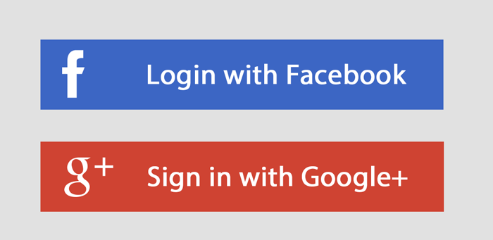
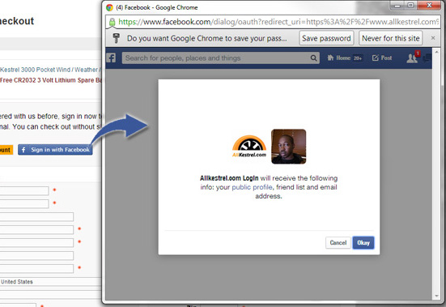
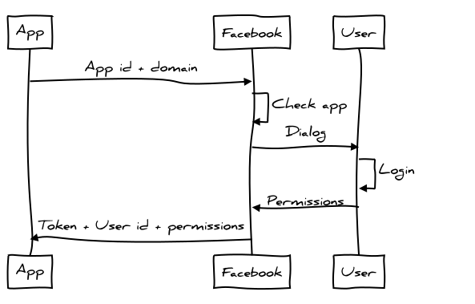

# Chapitre 9: Identification avec Google et Facebook

Objectifs:

- Intégrer un bouton de connexion pour identifier l'utilisateur
- Gérer l'état de l'application en fonction de l'identification

 > (<a href="./slides/15-auth/index.html" target="_blank">Slides du TP</a>)

---

## Introduction

Identifier l'utilisateur d'une application consiste à connaitre l'identité de la personne qui utilise une application depuis son navigateur, afin de:

- personnaliser son expérience d'usage de l'application; (ex: garder l'historique des derniers achats, sur un site e-commerce)
- restreindre l'accès à certains utilisateurs. (ex: contrôles JavaScript seulement accessibles aux étudiants de l'EEMI)

Sur la plupart des sites, cette identification est matérialisée par trois opérations:

1. la création d'un compte utilisateur, en fournissant par exemple un email et un mot de passe; (en anglais: `user sign-up` ou `user registration`)
2. la vérification de l'identité de l'utilisateur, en demandant par exemple à l'utilisateur de cliquer sur un lien envoyé à l'adresse email qu'il a fourni lors de la création de son compte (ou par SMS); (permet de s'assurer que l'adresse email est valide, et de réduire les risques d'usurpation d'identité)
3. puis l'identification à proprement parler de l'utilisateur sur son compte, en saisissant ses identifiants. (en anglais: `user log-in` ou `user sign-in`)

## Identification par plateforme tierce

Plusieurs plateformes tierces (dont Google et Facebook) fournissent aux développeurs d'applications des moyens de rendre plus rapide l'identification des utilisateurs. Ces moyens consistent à donner accès à l'identité d'un utilisateur une fois que celui-ci accepte de partager ces informations avec l'application.

Le mécanisme le plus répandu est **OAuth**. Il standardise les échanges nécessaires entre la plateforme tierce d'identification et une application, afin que cette dernière puisse accéder aux informations de l'utilisateur, voire à certaines fonctionnalités supplémentaires.

Dans ce cours, nous n'allons pas décrire le fonctionnement de OAuth, mais en récapituler les grandes lignes.

### Ce que voit l'utilisateur

Voici ce qui est affiché à l'utilisateur, après qu'il ait cliqué sur un bouton "Se connecter avec Facebook" (en anglais: "Facebook Connect") depuis une application web:

Cette page web est générée par Facebook pour demander à l'utilisateur s'il accepte de partager ses données d'identification avec l'application depuis laquelle il a cliqué sur le bouton.

Le plus souvent, ces données contiennent notamment le nom de l'utilisateur, son adresse email, et sa photo de profil. Parfois plus.

Ces données sont envoyées à l'application seulement si l'utilisateur accepte.

### Échanges entre l'application et la plateforme tierce

Du point de vue du développeur d'une application, l'identification des utilisateurs via une plateforme tierce se déroulle en six étapes:

1. L'application s'identifie auprès de la plateforme, à l'aide d'un identifiant souvent appelé `APP_ID`, `CLIENT_ID` ou `API_KEY`.
2. La plateforme vérifie la validité de cet identifiant, et sa concordance avec le nom de domaine depuis lequel l'identification a été demandée.
3. La plateforme génère et affiche une page à l'utilisateur, pour lui demander sa permission avant de partager ses information personnelles avec l'application.
4. Après avoir éventuellement ajusté ses préférences, l'utilisateur donne sa permission.
5. La plateforme prend note des préférences de vie privée de l'utilisateur, pour cette application.
6. Enfin, elle contacte l'application pour l'informer de l'accord de l'utilisateur, et lui transmet un jeton (en anglais: `token`), une chaine de caractères que devra utiliser l'application pour communiquer désormais avec la plateforme. Par exemple: pour accéder aux informations personnelles de l'utilisateur.

## Mise en oeuvre

Dans la plupart des cas, le développeur d'application peut gagner beaucoup de temps en utilisant un bibliothèque (en anglais: *library*) ou un SDK (*Software Development Kit*) fourni par la plateforme.

Il existe de nombreux guides sur Internet comment utiliser ces outils, pour les applications Web et Mobile.

Dans notre cas, nous allons utiliser le SDK [Google Platform Library](https://developers.google.com/identity/sign-in/web/sign-in) depuis notre application Web JavaScript.

### Pratique: Intégration Google Sign-in

Nous allons développer:

- une application qui affiche le nom de l'utilisateur quand il est connecté,
- et lui permet de se déconnecter.

Pour cela, cloner et compléter l'application suivante sur jsbin: [`https://jsbin.com/haxeqad/edit?html,js,output`](https://jsbin.com/haxeqad/edit?html,js,output)

Pour vous aider:

- [Integrating Google Sign-In into your web app](https://developers.google.com/identity/sign-in/web/sign-in)

> Note importante: la clé `CLIENT_ID` fournie dans le code ne fonctionne que depuis le site `jsbin.com`. Vous ne pourrez donc pas utiliser ce code pour identifier des utilisateurs depuis un autre domaine, ni depuis votre propre machine.

> Solution: [jsbin.com/tuyofec](https://jsbin.com/tuyofec/edit?html,js,output)

### Exercice: Login en production

Maintenant que nous savons intégrer un bouton Google Signin à une application, nous allons créer notre propre clé `CLIENT_ID`, de manière à ce que notre application puisse fonctionner depuis un autre domaine que `jsbin.com`.

Pour cela, vous allez devoir déclarer votre propre application auprès de Google et configurer votre propre clé `CLIENT_ID`.

Étapes proposées:

1. Héberger le code précédent sur votre espace étudiant, observer l'erreur obtenue
2. Se connecter à la [Console Google Developers](https://console.developers.google.com/project/_/apiui/apis/library) avec son compte EEMI
3. Créer un projet, et moyen de s'identifier à l'application Web avec "OAuth" depuis votre domaine
4. Intégrer la clé `CLIENT_ID` fournie dans votre page, puis tester la connexion et déconnexion.
5. BONUS: restreindre l'accès qu'à certaines personnes.
6. BONUS: Refaire l'exercice avec Facebook Connect au lieu de Google Signin.

Pour vous aider:

- [
Creating a Google API Console project and client ID](https://developers.google.com/identity/sign-in/web/devconsole-project)

autres références:
- [Registering OAuth clients for Google Sign-In
](http://android-developers.blogspot.fr/2016/03/registering-oauth-clients-for-google.html)
- [Facebook Login for the Web with the JavaScript SDK](https://developers.facebook.com/docs/facebook-login/web)
