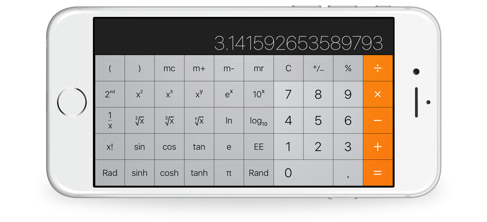

class: center, middle

# Cours JavaScript
## EEMI - 1ère Année

???

- faire l'appel

---
# Programme d'aujourd'hui

1. Programme JavaScript
1. Méthodologie et évaluation
1. Conseils des étudiants de l'an dernier
1. Introduction JavaScript


---
## 1. Programme du cours JavaScript

- Les fondamentaux
- JavaScript sur le Web

???

Le programme de Javascript est en deux parties:

- On va commencer par les fondamentaux: comprendre qu'est-ce qu'un programme Javascript, quel est le lien avec le web, quelle est la structure du langage, comment écrire et tester du code et des algorithmes. Pour mettre tout ça en pratique, on va coder des petits jeux.
- Pendant le deuxième semestre, on va apprendre à écrire du javascript pour le web. Ça vous permettra de créer des sites interactifs.

---
## 2. Méthodologie

- Cours fourni avant chaque TP
- 30mn d'explications, **sans PC**
- puis pratique, à 2 sur 1 PC
- TPs à rendre sur Classroom
- Examens sur PC: documents OK, communication NOK

### => Conseil: prendre des notes sur papier.

???

Comment on va procéder ?

- Avant chaque cours, je vous enverrai une introduction aux concepts qu'on abordera, pour que vous puissiez vous mettre dans le bain, et venir en cours avec plein de questions à me poser. Plus vous aurez de questions, plus vous serez curieux, mieux vous comprendrez et retiendrez le contenu du cours.
- En début de cours, je vous expliquerai les fondamentaux en moins de 20mn. Pendant ces 20 minutes, je vous demanderai de garder votre machine fermée. Je vous fournirai systématiquement les supports de cours, mais pensez à prendre un carnet et un crayon si vous voulez prendre des notes. Vous comprendrez et retiendrez forcément mieux comme ça !
- Après les 20mn de théorie, tout le reste du cours sera dédié à la pratique. Vous experimenterez sur machine, et par groupes de deux (une machine pour deux), ce qu'on viendra d'apprendre. Vos TPs seront systématiquement à rendre via Classroom, avant le TP suivant.
- Tous les exercices et les partiels de JS seront sur machine, pour que ce soit plus pratique d'éditer votre code. Et, comme un développeur ne retient jamais tout par coeur, vous aurez toujours droit à vos notes, vos supports de cours, et à l'intégralité d'Internet. La seule exception est que vous n'aurez pas le droit d'utiliser de systèmes de messagerie (email, chat, sms...) pendant les évaluations individuelles.

---
## 2. Évaluation

- 2 partiels
- 4 contrôles notés en classe
- TPs à rendre notés

### Réussite = concentration + pratique + rigueur + entraide

???

Comment vous serez évalués ?

- chaque semestre = 2 contrôles en classe + 1 devoir noté + 1 partiel. notes individuelles.
- Je distribuerai des points bonus en fonction de votre comportement en classe, votre participation active, le respect des dates de rendu, et l’aide que vous aurez donné à vos camarades.

Si vous finissez vos exos avant le reste de la classe => aidez vos camarades, et demandez moi des challenges supplémentaires par email. Ça vous permettra de monter en niveau encore plus vite, et de ne pas vous ennuyer!

Comme vous l’avez compris, je veux encourager l’entraide et la bienveillance.
Mon but est que vous appreniez dans la bonne humeur!
Je suis pour qu’on s’amuse, du moment que vous faites les efforts nécessaires pour progresser.

Si vous vous comportez de manière positive et pro-active, je vous donnerai des points.
Si vous vous comportez de manière passive ou irrespectueuse, vous me devrez des explications en face à face.

Je vous demanderai aussi d’être extrêmement rigoureux dans votre lecture des énoncés, et dans mes instructions pour rendre vos exercices et devoirs. Vous allez voir que c’est une qualité hyper importante quand vous programmez une machine, car elle pense en binaire.
=> Pour être plus clair: si vous rendez un devoir mais avez pas suivi à la lettre mes instructions sur “comment le rendre”, vous risquez d’obtenir un zéro. C’est dur, mais vous me remercierez plus tard!

---
class: center, middle
# 3. Conseils des étudiants de l'an dernier

---
class: center, middle, dbl-size

💪

.quote[
**S'accrocher dès le début**, car tout ce qui est fait au début est utile pour la suite.
]

---
class: center, middle, dbl-size

😴

.quote[
**Ne pas lâcher prise** à la moindre difficulté. Pratiquer.
]

---
class: center, middle, dbl-size

😎

.quote[
**Ne pas croire** que si l'on comprend (ou pense comprendre) le code, ça suffit. Entre le lire et le faire c'est pas la même.
]

---
class: center, middle, dbl-size

✍️

.quote[
**Relire** les chapitres du cours avant de venir. Et ne pas hésiter à refaire les exercices.
]

---
class: center, middle, dbl-size

🏋

.quote[
Lire les documentations, essayer de comprendre par soi-même, surtout **pratiquer chez soi**.
]

---
class: center, middle, dbl-size

🎻

.quote[
**Refaire** régulièrement les exercices vus en cours afin de pouvoir les implémenter dans les sites à réaliser au cours de l'année
]

---
class: center, middle, dbl-size

🐾

.quote[
Ne pas hésiter à **tester**.
]

---
class: center, middle


.quote[
Que la force soit avec vous :D
]

---
class: center, middle

# JavaScript
## Les Bases 🗿

---
class: center, middle, dbl-size

# 🎯 Objectifs

1. 🗿 Présentation et historique du langage JavaScript
2. 🔧 Comment ça fonctionne ?
3. 🆎 Valeurs et types
4. 🗳 Variables

---
class: center, middle

# 1. Le Langage JavaScript

---
class: center, middle

## Programmation
## =
## Donner des instructions à une machine 🤖

---
class: center, middle

## Programme
## =
## Recette de cuisine 🍳

---
class: center, middle

## `Does not compute`

---
class: center, middle

## JavaScript / ECMAScript

---
class: center, middle
background-image: url(./img/netscape.jpg)

---
class: center, middle
background-image: url(./img/isnotjava.png)

---
class: center, middle

# 2. Comment ça fonctionne ?

---
class: center

## Exécution séquentielle VS interactive ⌨


---
class: center
background-image: url(./img/chrome-console.png)

## ⌨ Console JavaScript

---
class: center, middle

## Langage de script
## ⇓
## Faiblement typé

---
class: center, middle

# 3. Valeurs et types 🆎

---
class: center, middle, dbl-size

## 🆎 Types simples

+ nombre
+ booléen: `true`, `false`
+ chaîne de caractères / string: `'coucou'`
+ `null`

---
class: center, middle, dbl-size

## 🆎 Types avancés

+ `undefined`
+ objet: `{ prop: 'valeur' }`
+ tableau / array: `[ 1, 2, 3 ]`
+ fonction: `function(){ /* ... */ }`

---

.center-block.col-50pct[
## 🆎 Exercice: Quel type ?

1) Reconnaissez les types des valeurs ci-dessous.

```js
0
true
2 - 1.2
'hello'
'bonjour' + 4
{ a: 0.4 }
[ 'a', 'b', 'c' ]
```
]

--

.center-block.col-50pct[
2) Vérifiez vos réponses en saisissant ces opérations dans la console, et en utilisant le mot clé `typeof`.
]
--

.center-block.col-50pct[
3) Expliquez le type de la dernière ligne.
]

---
class: center, middle

# 4. 🗳 Variables

---
class: center, middle

## Littéral
## ⇓
## Symbolique 🗳

---
class: center, middle, quote

Soit x=4...

---
class: center, middle, dbl-size

```js
var nombreSaisiParUtilisateur = 4;
```

---
class: middle, dbl-size

.center[
## Affectation 📥
]

```js
var tauxConversion = 1.43;
tauxConversion = 1.47;
```

.center[
⇒ Quelle est la valeur finale de `tauxConversion` ?
]

---

.center-block.col-50pct[
## Exercice: Création de variables 📥

1) Créez les variables suivantes:

- `monNombre` avec une valeur de `4`,
- `maChaine` contenant `'bonjour ! :-)'`,
- `monBooleen` valant `false`,
- `sansValeur` à laquelle vous n'aurez affecté aucune valeur.
]

--

.center-block.col-50pct[
2) Vérifiez que chaque instruction ci-dessous répond `true`:

```js
monNombre === 4;
maChaine === 'bonjour ! :-)';
monBooleen === false;
sansValeur === undefined;
```
]
